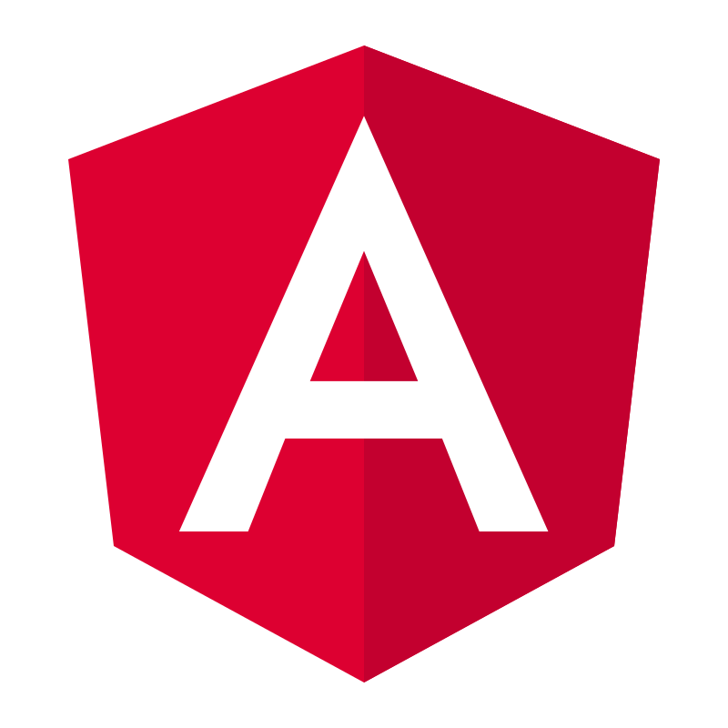
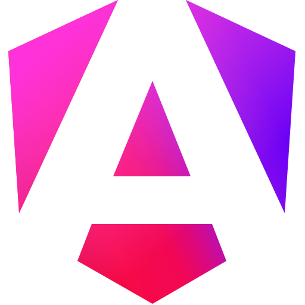
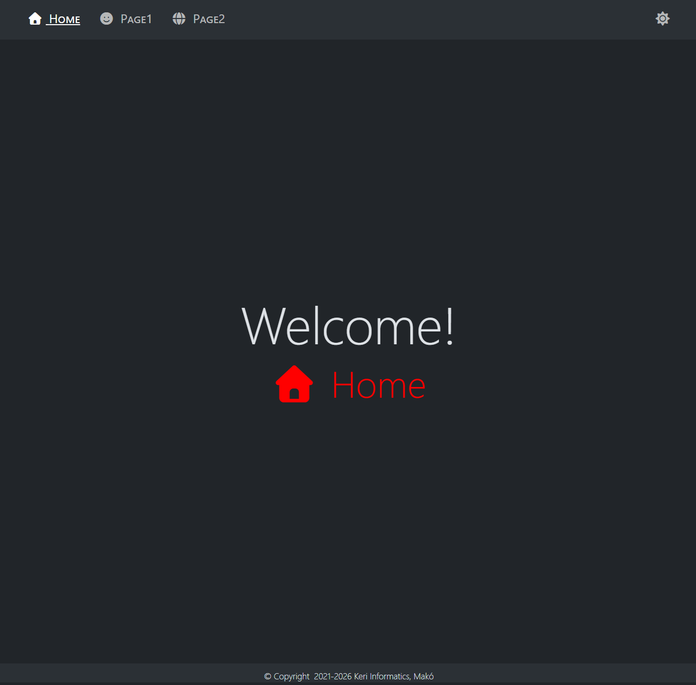
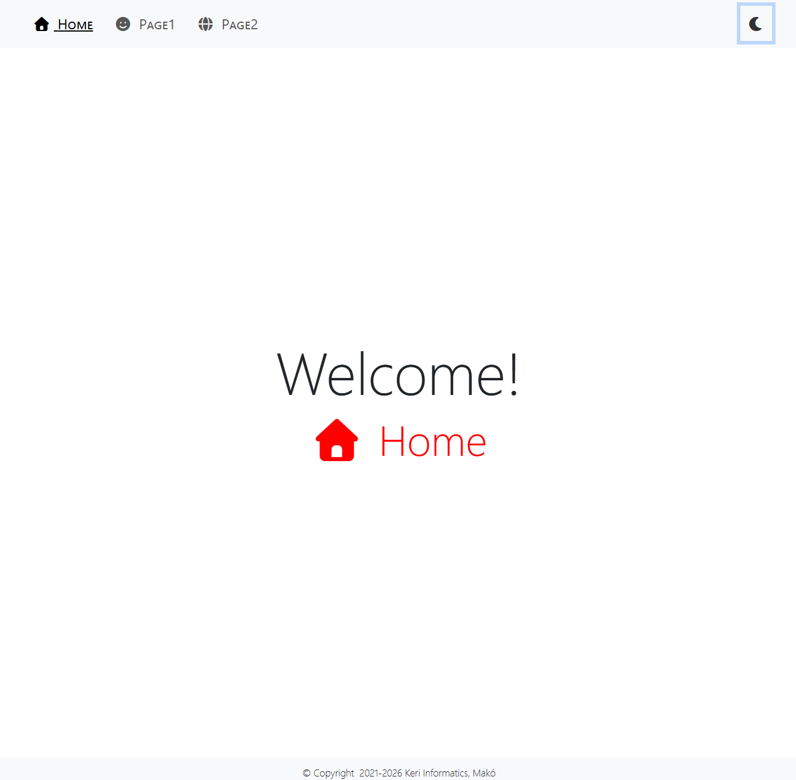
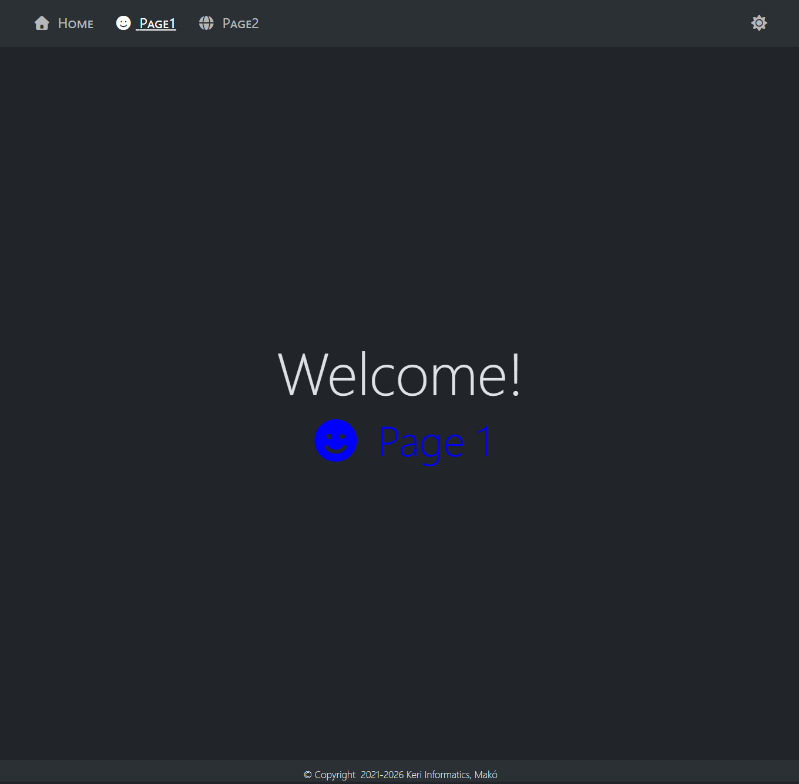
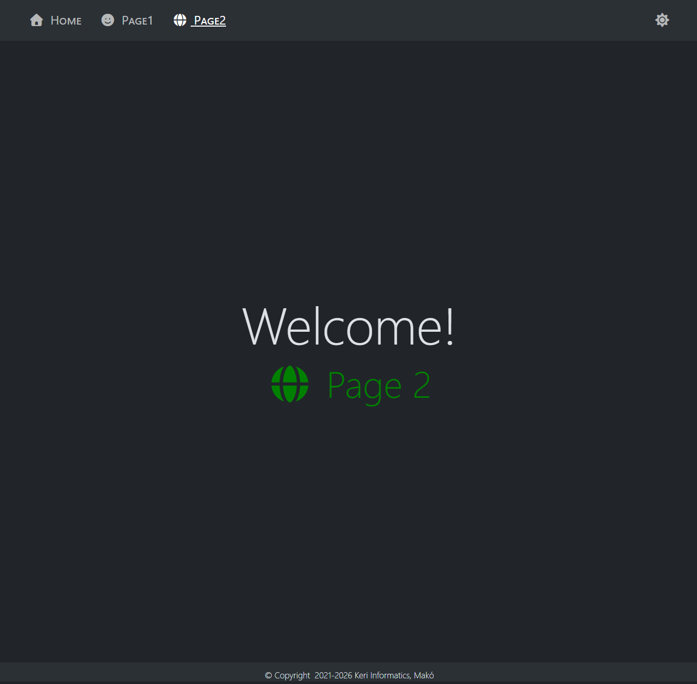
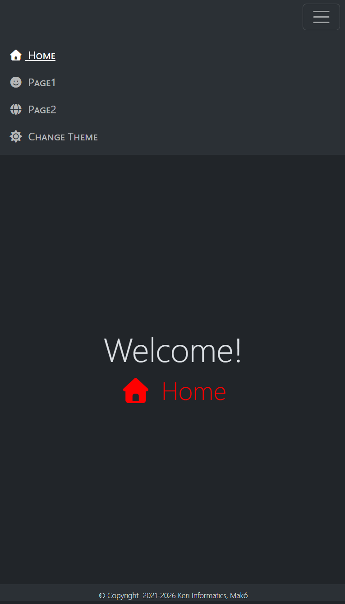
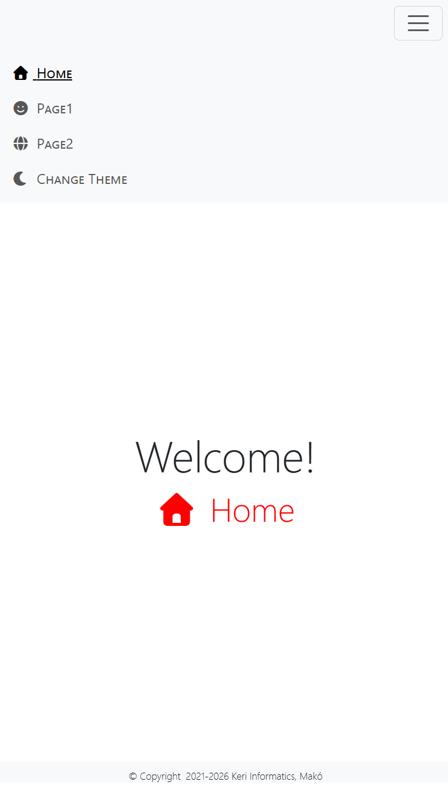

# Modern web frameworks
Simple application with routes

## Implementations
-  Initial
-  AngularJS
-  Angular
-  React
-  Vue
-  Svelte

All implementations reproduce essentially the same user interface and behavior:
- responsive Bootstrap navigation
- Home, Page1 and Page2 navigation
- active navigation item
- dark/light theme stored in localStorage
- page-specific styles
- dynamic footer year

The five framework implementations additionally demonstrate routing, reusable components,
shared application state and framework-specific lifecycle handling.
  
## Screenshots
<div>
	
	
</div>
<div>
	
	
</div>
<div>
	
	
</div>

## Development environment
- HTML5
- CSS3
- Bootstrap v5.3.8
- Font Awesome v7.3.1
- JavaScript ES6+

## Minimum development environment
- Node.js v22.22.3
- npm v11
- TypeScript v6.0.x

## `Node.js` – Brief Overview

Node.js allows JavaScript code to run outside the browser, directly on a computer or on a server.

In modern web development, we mainly use it in two important areas:

- **Development and build processes (Frontend):**  
  When developing modern web applications, Node.js runs the development tools in the background.
  It allows us to start a local development server, process and optimize the source code, and create the final, deployable version of the web application.

  The completed frontend application usually runs in the browser, while Node.js is mainly needed during development and the build process.

- **Running server-side applications (Backend):**  
  Node.js can also be used to create server-side applications. These applications can receive requests from the frontend, process them,
  communicate with databases and other services,
  and then send responses back to the frontend.

### `npm` (Node Package Manager)

npm is the package management system used with Node.js. It allows us to install ready-made software packages and libraries into our projects, so we do not have to build every feature from scratch.

In this project, for example, we use npm to:
- install the required packages,
- start the development server,
- check the application,
- create the production build.
  
## Framework versions
- AngularJS v1.8.2
- Angular UI-Router v1.1.2
- AngularCSS v1.0.8
- Angular v22.x
- Angular CLI v22.x
- React v19.x
- React Router v8.x
- Vue v3.5+
- Vue Router v5.x
- Svelte v5.x
- svelte-spa-router v5.x

## Check development environment
```bash
node --version
npm --version
tsc --version
ng version
```

## Update the development environment
> Angular projects use the TypeScript version defined in the project's dependencies.  
> Do not update TypeScript independently without checking Angular compatibility.
```bash
npm install -g npm@11
npm install -g typescript@6.0
npm install -g @angular/cli@22
```

> Alternatively, update to the latest versions with CAUTION:
```bash
npm install -g npm@latest
npm install -g typescript@latest
npm install -g @angular/cli@latest
```

## Create projects if they don't already exist
-  Angular
	```bash
	ng new angular --skip-tests
	# --skip-tests: do not generate test files
	```
-  React
	```bash
	npm create vite@9 react -- --template react-ts
	```
-  Vue
	```bash
	npm create vue@3
	```
-  Svelte
	```bash
	npm create vite@9 svelte -- --template svelte-ts
	```

---

## Framework comparison
| Feature | AngularJS | Angular | React | Vue | Svelte |
|---|---|---|---|---|---|
| Main concept | Controllers + scopes | Components + services | Components + hooks | Components + Composition API | Compiled components + runes |
| Main language | JavaScript | TypeScript | TypeScript / TSX | TypeScript + templates | TypeScript + Svelte syntax |
| Component structure | Separate HTML + JS + CSS | TS + HTML + CSS | TSX + CSS Module | Single-file `.vue` component | Single-file `.svelte` component |
| Routing | Angular UI-Router | Angular Router | React Router | Vue Router | svelte-spa-router |
| Navigation | `ui-sref` | `routerLink` | `NavLink` | `RouterLink` | `use:link` |
| Shared application state | `$rootScope` | Service + `signal()` | Context + `useState()` | Composable + `ref()` | Shared `$state()` |
| Lifecycle used in this project | Controller / `.run()` | `ngOnInit()` | `useEffect()` | `onMounted()` | `onMount()` |
| Template value syntax | `{{ value }}` | `{{ value }}` | `{value}` | `{{ value }}` | `{value}` |
| Conditional classes | `ng-class` | `[class.name]` | JavaScript expression | `:class` | `class:name` |
| Component/page styles | AngularCSS + separate CSS | Component style encapsulation | CSS Modules | `<style scoped>` | `<style>` scoped by default |
| Build tool | Not required | Angular CLI | Vite | Vite | Vite |
| Routing mode in this project | Hash | History | History | History | Hash |
| Dependency injection | Built in | Built in | No built-in DI | No traditional DI | No traditional DI |
| Theme state in this project | `$rootScope` | Component property | `useState()` | `ref()` | `$state()` |
| Active navigation | `ui-sref-active` | `routerLinkActive` | `NavLink` active state | `RouterLink` active class | `use:active` |

### Main similarities

All five framework implementations solve the same basic problems: routing, reusable components, shared state, lifecycle handling, conditional styling, responsive navigation, theme switching, and page-specific styles.

### Main differences

The biggest differences are in syntax and architecture. AngularJS and Angular provide more framework-level structure and dependency injection, React relies heavily on JavaScript/TypeScript and hooks, Vue combines templates with the Composition API, while Svelte uses compiler-based reactivity and concise component syntax.

## Install dependencies
```bash
./install.bat
```

## Start
```bash
./start.bat
```

## Build
```bash
./build.bat
```

## Build preview
```bash
./build-preview.bat
```
